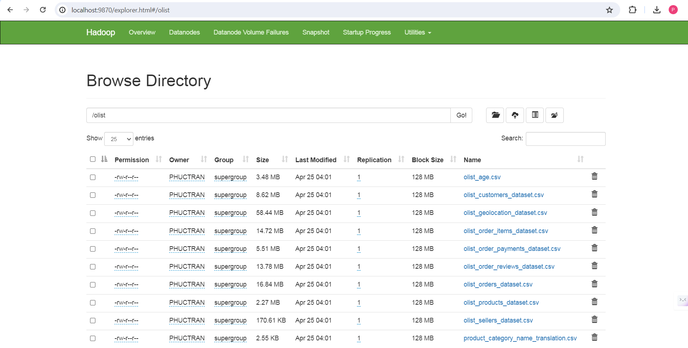

# Ecommerce analysis in Olist's retail dataset
## Project overview
The project aims to analyze the ecommerce dataset concerning **Olist retail**. The primary technologies employed include Hadoop, Azure Synapse Analytics, and Power BI. Hadoop serves as the data storage solution, Azure Synapse facilitates data analysis, and Power BI is utilized for data visualization.

## Dataset
**Link Data Set:** [Olist Dataset](https://www.kaggle.com/datasets/olistbr/brazilian-ecommerce?select=product_category_name_translation.csv)

**About data:**
- This is the Brazilian E-Commerce Public Dataset by Olist. It contains information on 100k orders from 2016 to 2018 made at multiple marketplaces in Brazil. The dataset offers insights into various aspects of orders, including order status, price, payment, freight performance, customer location, product attributes, and customer reviews. Additionally, a geolocation dataset that correlates Brazilian zip codes to lat/lng coordinates is provided.
- The dataset has been anonymized, and references to companies and partners have been replaced with names from Game of Thrones great houses.

**Data Schema:**
- The data is divided into multiple datasets for better understanding and organization. Please refer to the following data schema when working with it.

**Example:**
Here is a segment of product data from the Olist dataset.

## Technologies version
- Apache Hadoop: version 3.3.6
- Apache Spark: version 3.4

## Design model

## Workflow
1. The original data is stored in Hadoop HDFS in CSV format.
2. Azure Data Factory facilitates the transfer of data from HDFS to Azure Data Lake for preparatory analysis.
3. Azure Data Lake Gen2 provides data to Azure Synapse Spark for analyzes.
4. Azure Synapse Spark performs the following tasks (you can read it at [here](analysisInSynapse.ipynb)):
   - Preprocesses the data.
   - Analyzes data.
   - Utilizes machine learning algorithms, including ALS (Alternating Least Squares) algorithms for recommending suitable products to customers and K-means algorithms for clustering customers.
   - Save the results as tables in Synapse SQL.
5. Power BI: Visualizes the results stored in Synapse SQL.

## Deployment instructions
##### 1. Upload dataset from your decive to HDFS
- Run `start-dfs.cmd` and `start-yarn.cmd` on CMD.
- Run `hdfs dfs -put <path folder in your device> <path folder on hdfs>`
- Example in my device:

- Check saved dataset on HDFS through link http://localhost:9870/explorer.html#/

##### 2. Transfering data from HDFS to Azure Data Lake Gen2 via Azure Data Factory
- In the Synapse Analytics Studio, navigate to the Integrate section and create a new pipeline.
- Within the pipeline, add a Copy Data activity. 
- Specify the source as a link to the file stored on Hadoop Distributed File System (HDFS), and designate the sink by selecting the desired file name and folder for storage on ADLv2.
- Finally, initiate the pipeline by triggering it manually.

##### 3. Integrate data from Synapse SQL to Power BI
- In the Synapse Analytics Workspace, locate the Serverless SQL endpoint and copy its address.

- Open Power BI, click on "Get Data," select Azure Synapse, and paste the copied Serverless SQL endpoint. Then, choose the table you wish to visualize.

## Result
##### 1. Olist data analysis

##### 2. Recommend Products for Customers

##### 3. Customer Clustering

## Conclude
In conclusion, the analysis of Olist's retail dataset using Hadoop, Azure Synapse Analytics, and Power BI offers invaluable insights into the ecommerce in Brazil. By harnessing the power of these cutting-edge technologies, we've been able to:
- Gain comprehensive understanding of customer interest, distribution of places of consumption, and sales,... through data analysis.
- Provide personalized product recommendations to customers using machine learning algorithms, enhancing their shopping experience and driving sales.
- Segment customers into distinct groups based on their age and total-spent, enabling targeted marketing strategies and improved customer engagement.

**This is a my first project about data engineering. Through it, I've acquired understanding the workflows of big data projects and technologies such as Hadoop, Azure Synapse Analytics, and Power BI. These learnings will be a foundation for my growth in data analytics. <3**